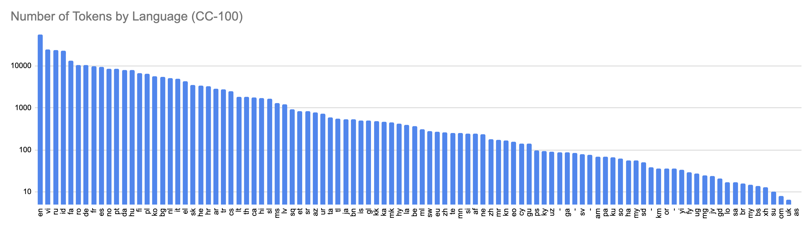

# CC-100 Dataset

This is the dataset used to train XLM-R. These numbers come from Appendix A (Table 6)
of the [XLM-R paper](https://arxiv.org/abs/1911.02116). The data was created using
CommonCrawl snapshots from January-December 2018.

Two languages differ from the paper: Ukrainian and Swedish. These languages had typos in
the original paper, and the values in this sheet came from personal commmunication with the authors.

Token counts in this CSV file refer to whitespace counts in raw text (I emailed the authors).

This counting method leads to some oddities in this data. Chinese (both Traditional and Simplified),
Japanese, and Thai are all languages that do not use whitespace to separate words. As a result, for these languages, the ratio of bytes per
token  -- roughly corresponding to characters per token -- is very large (~150 compared to ~7-10 for other
languages). I suppose these counts refer to the number of *sentences* rather than the number of tokens.

Similarly, Vietnamese has a particularly high token count, with a relatively small dataset size. This
is probably because Vietnamese was originally written using either Classical Chinese characters, or
using a set largely borrowed from Chinese characters with some original characters added ([source](https://en.wikipedia.org/wiki/Vietnamese_language)).
At some point, Vietnamese was romanized, and each character was written with a few letters
of the Latin alphabet, using many diacritics. Relevant to this dicussion, spaces were also put between characters.
In this sense, a "word" in Vietnamese may consist of several white-space separated tokens, just as a word in Chinese
may consist of several contiguous characters.

See also [http://data.statmt.org/cc-100/](http://data.statmt.org/cc-100/), which bills itself
as an "attempt to recreate the data used in XLM-R", which suggests it may not match exactly. Note that
the file sizes listed on that website report _compressed_ file size, but the numbers
in this csv file report _uncompressed_ file size.

I compared token counts from the CSV file against word counts (using `wc -w`) in the raw
untokenized text files from the website. The numbers are very similar for 2/3 languages.
I'm not sure how to interpret this -- perhaps the Moses tokenization of Uyghur splits too many
words.

| Language | Compressed size | Uncompressed Size | Words (wc -w) | Tokens (from table) |
|----------|-----------------|-------------------|---------------|---------------------|
| ug       | 46M             | 377M              |    32,359,813 | 27M                 |
| xh       | 25M             | 111M              |    13,465,828 | 13M                 |
| sw       | 332M            | 1.6G              |   275,281,887 | 275M                |

