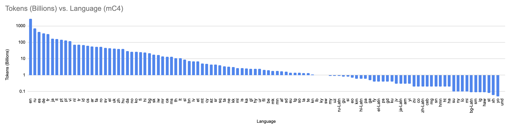

# mC4 Token Counts

This was the data used to train [mT5](https://arxiv.org/abs/2010.11934). These numbers came from Table 5 in the mT5 paper.

I don't know what "tokens" refers to -- whether it is whitespace-delineated words, or byte-pair encoded tokens.

This data can be found [here](https://www.tensorflow.org/datasets/catalog/c4#c4multilingual). I have not validated the data
sizes against the table.

