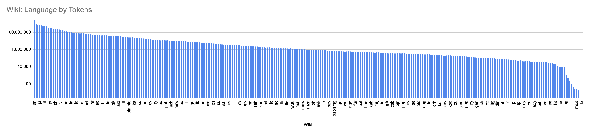

# Wikipedia Stats for All Languages

All stats are from the 20201001 dump.

This CSV file comes from a few different sources.

Several of the columns (Language, Language (Local), Wiki, Articles) are from the [List of Wikipedias](https://meta.wikimedia.org/wiki/List_of_Wikipedias), accessed August 2020.

The "Wiki Size (bytes)" column is the number of bytes in the *compressed dump*, as available from the 20201001 dump from the [Wikimedia dumps page](https://dumps.wikimedia.org/). For examples, see the "pages-articles" file from the [English dump](https://dumps.wikimedia.org/enwiki/20201001/). These sizes were gathered using [this gist](https://gist.github.com/mayhewsw/c45007bdeb5d3f1391a7e03b2ac23d0d). The "Uncompressed Wiki Size (bytes)" column is the size of the processed tokenized text file called `*.all`..

The "Tokens" field is calculated over each dump from 20201001. Using code from [XLM-R repo](https://github.com/facebookresearch/XLM), specifically the [`get-data-wiki.sh`](https://github.com/facebookresearch/XLM/blob/master/get-data-wiki.sh) script, then running `wc -w` on the tokenized `*.all` text file. I did this on a c5.2xlarge instance on AWS, which took about 2 days (with some gaps for troubleshooting) and about $20.

The "In mBERT?" column came by matching languages up against the [mBERT readme](https://github.com/google-research/bert/blob/master/multilingual.md).

